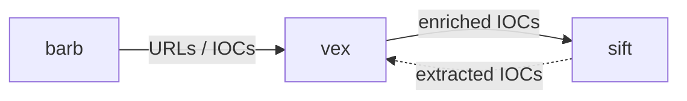

<p align="center">
  
</p>

<h1 align="center">vex</h1>

<p align="center">
  <b>IOC enrichment hub for SOC triage and DFIR — VirusTotal + AbuseIPDB / Shodan / WHOIS / MISP / OpenCTI, straight from your terminal.</b>
</p>

<div align="center">
<pre>
 ██╗   ██╗███████╗██╗  ██╗
 ██║   ██║██╔════╝╚██╗██╔╝
 ██║   ██║█████╗   ╚███╔╝
 ╚██╗ ██╔╝██╔══╝   ██╔██╗
  ╚████╔╝ ███████╗██╔╝ ██╗
   ╚═══╝  ╚══════╝╚═╝  ╚═╝
</pre>
</div>

<p align="center">
  
  
  
</p>

---

`vex` takes an indicator (a hash, IP, domain, or URL) and turns it into a verdict with context. It started as a VirusTotal CLI and grew into an enrichment hub: one primary source (VirusTotal) plus optional secondary sources that add reputation and your own threat-intel. It runs standalone, and it slots into a pipeline (**barb → vex → sift**) over stdin/stdout.

> [!NOTE]
> This README documents the installed build, `vex 1.4.0`. The working tree on `main` already carries the v1.5.0 feature set described below (MISP/OpenCTI lookup, `vex doctor`, NDJSON, correlation); the version string is bumped at release time.

## Install

```bash
pip install vex-ioc          # core
pip install vex-ioc[ai]      # + Anthropic / OpenAI explanations (Ollama needs no extra)
```

## Quickstart

```bash
vex config --set-api-key YOUR_VT_KEY     # or set VT_API_KEY
vex triage 8.8.8.8
vex triage evil.com --explain            # add an AI narrative
vex investigate <sha256> -o rich         # deep dive
```

```text
IOC: 8.8.8.8 (ipv4)
Verdict: CLEAN
Detections: 0 malicious / 0 suspicious / 94 engines
Reputation: 0
```

## What you get

- **Two modes** — `triage` (fast verdict, minimal API calls) and `investigate` (deep DFIR: PE info, sandbox behavior, passive DNS, relationships, MITRE ATT&CK, timeline).
- **Multi-source enrichment** — VirusTotal primary; AbuseIPDB, Shodan, WHOIS, MISP, and OpenCTI as secondary enrichers (key-gated, fail-open).
- **Batch correlation** — `--correlate` clusters a batch of IOCs by shared infrastructure (ASN, malware family, contacted IPs/domains).
- **AI explanations** — opt-in `--explain` narratives (Claude / OpenAI / local Ollama / deterministic template), with prompt-injection defense on the untrusted data fed to the model.
- **Pipeline-ready output** — JSON, NDJSON (streaming), CSV, STIX 2.1, ATT&CK Navigator, self-contained HTML; verdict-mapped exit codes.
- **Quota-aware batches** — IOC dedup, an up-front ETA, and a `--max-quota` budget guard.
- **Local knowledge base** — `vex tag` / `note` / `watchlist` annotate IOCs in `~/.vex/`.

## Verdicts

| Verdict | Meaning |
|---------|---------|
| 🟢 `CLEAN` | No engine flagged it. |
| 🟡 `UNKNOWN` | Not enough data, or the IOC was not found. |
| 🟠 `SUSPICIOUS` | Low-confidence detections. |
| 🔴 `MALICIOUS` | Meets the malicious-detection threshold. |

## Enrichment sources

VirusTotal is the **primary** source; it produces the verdict. The others are **secondary enrichers** that augment an `investigate` result.

| Source | IOC types | Enable via |
|--------|-----------|-----------|
| VirusTotal | all | `VT_API_KEY` / `--api-key` / `vex config` |
| AbuseIPDB | IP | `VEX_ABUSEIPDB_API_KEY` |
| Shodan | IP | `VEX_SHODAN_API_KEY` |
| WHOIS | domain | core (no key) |
| MISP | all | `MISP_URL` + `MISP_API_KEY` |
| OpenCTI | all | `OPENCTI_URL` + `OPENCTI_TOKEN` |

> [!IMPORTANT]
> Secondary enrichers run on **`investigate` only**, not `triage` (triage stays fast). Each is **no-op without its key**, **fail-open** (a failure or timeout never blocks the run), and they run **concurrently**. Run `vex doctor --probe` to see which are configured and reachable.

## Correlation

```bash
vex triage -f iocs.txt --correlate            # deterministic cluster table
vex triage -f iocs.txt --correlate --explain  # + per-cluster AI campaign narrative
```

`--correlate` groups a batch by shared ASN, malware family, contacted IPs, and contacted domains — surfacing likely campaigns. It is deterministic by default; the AI narrative is added only when `--explain` is also set.

## AI explanations

`--explain` adds a narrative and next steps; `--explain-model` overrides the model. Providers: Anthropic, OpenAI, local Ollama, and a deterministic template fallback when none is configured.

```bash
export VEX_AI_PROVIDER=ollama        # local, no cloud key
vex investigate evil.com --explain
```

> [!WARNING]
> Enrichment data (sandbox strings, file names, family labels) is attacker-influenceable. Before it reaches an LLM, `vex` scans it for prompt-injection patterns and redacts critical attempts, and the system prompt instructs the model to treat the data as untrusted. This is defense-in-depth, not a guarantee.

## Output formats

`-o rich` (default TTY) · `-o console` · `-o json` · `-o ndjson` (one result per line, streamed) · `--csv` · `--stix` · `--navigator` (ATT&CK layer, investigate) · `--html <path>` (self-contained report). IOCs are defanged in TTY/HTML output and on `--defang`; machine formats keep real IOCs.

```bash
sift triage alerts.json -o json | vex triage --from-sift -o ndjson
```

## Pipeline



vex is the enrichment hub. `--from-barb` reads barb JSON; `--from-sift` reads a sift `TriageReport`, extracts its IOCs, and enriches them — closing the sift ↔ vex loop. NDJSON output and verdict exit codes make it scriptable downstream.

## Scale

For large batches, such as IOCs extracted from a SIEM export:

- **Dedup** — duplicate IOCs are collapsed before any query, which saves quota; `--no-dedup` disables it.
- **ETA + counters** — an up-front estimate and a `processed (N from API, M cached)` summary on stderr.
- **`--max-quota N`** — caps fresh API lookups; cached IOCs are still served, the rest are skipped with a notice. Re-run to continue — the SQLite cache resumes where you left off.

## Configuration

Priority: `--api-key` flag → environment variable → `~/.vex/config.yaml` → defaults.

```bash
vex config --show        # active config, masked secrets
vex doctor               # what's configured (no network)
vex doctor --probe       # + live connectivity, surfaces the actual error
```

| Variable | Purpose |
|----------|---------|
| `VT_API_KEY` | VirusTotal |
| `VEX_AI_API_KEY` / `VEX_AI_PROVIDER` / `VEX_AI_MODEL` | AI provider |
| `VEX_ABUSEIPDB_API_KEY` | AbuseIPDB enricher |
| `VEX_SHODAN_API_KEY` | Shodan enricher |
| `MISP_URL` / `MISP_API_KEY` | MISP lookup |
| `OPENCTI_URL` / `OPENCTI_TOKEN` | OpenCTI lookup |

`enrichment.stix_tlp_version` (`1.0` default, `2.0`) selects which STIX TLP marking ids the export emits.

## Security

> [!WARNING]
> - Secondary enrichers (AbuseIPDB / Shodan / WHOIS / MISP / OpenCTI) **fail-open — never block a run — and are no-op without a key**.
> - The VT API key is **never hard-coded** — env var, config, or `--api-key`.
> - Premium calls are **gated behind `config.is_premium`**; the free tier is never broken.
> - **Restricted TI: TLP/markings are carried through; marked intel is never emitted unmarked.**
> - Machine output stays clean — all notices go to **stderr**, not stdout.

## Exit codes

| Code | Meaning |
|------|---------|
| `0` | clean / suspicious |
| `1` | malicious |
| `2` | error |

## Known limitations

- **MISP and OpenCTI lookups are validated against mocks; OpenCTI was also live-verified against the public demo (v7.26).** Both query real instances and are version-sensitive — if a server's schema differs, the enricher **fails open** (no enrichment, no crash). Use `vex doctor --probe` to confirm connectivity. `pycti` is a possible future fallback if raw GraphQL drifts.
- **AI: Anthropic and Ollama are live-verified end-to-end; OpenAI shares the same code path (mock-tested).** Without a provider, `--explain` falls back to a deterministic template.
- **Secondary enrichers run on `investigate`, not `triage`.** A `triage --explain` gets no AbuseIPDB / Shodan / MISP / OpenCTI context by design.
- **STIX TLP:CLEAR maps to the TLP 1.0 WHITE marking id by default** — set `enrichment.stix_tlp_version: "2.0"` to switch to TLP 2.0 ids.
- The VirusTotal free tier allows roughly 4 requests/min, so large batches are quota-bound — see [Scale](#scale).

## Docs

Built-in guide: `vex manual` (and `vex manual ai` / `pipeline` / `config`). Changelog: [`CHANGELOG.md`](CHANGELOG.md).

## License

MIT
