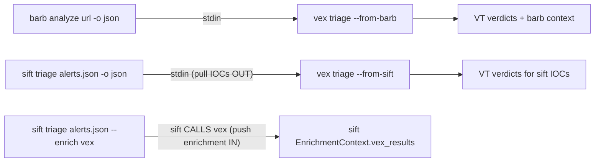
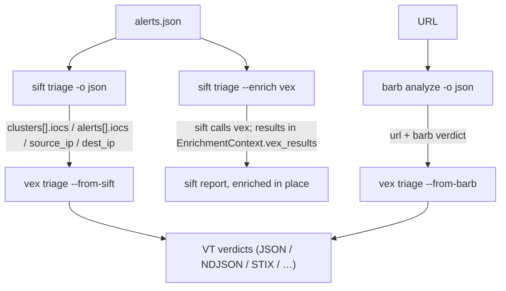

# Pipeline

[← Docs index](README.md)

`vex` is the enrichment hub of a three-tool chain. Upstream, **barb** pre-scans
URLs heuristically; **sift** clusters and triages alerts. `vex` enriches the IOCs
that those tools surface against VirusTotal (+ secondary sources), and the result
can flow back into sift.

There are three flows. The direction of data is the thing to get right:



| Flow | Who reads whom | Use it to… |
|------|----------------|------------|
| `barb → vex` (`vex triage --from-barb`) | vex reads barb JSON from stdin | enrich the URLs barb pre-scanned, with barb's verdict shown alongside VT |
| `sift → vex` (`vex triage --from-sift`) | vex reads sift JSON from stdin | pull every IOC out of a sift report and enrich it with VT |
| `vex → sift` (`sift triage … --enrich vex`) | **sift calls vex** | push vex enrichment **into** sift's alerts |

> [!IMPORTANT]
> `vex --from-sift` (a pipe) pulls IOCs **out of** a sift report. `sift --enrich
> vex` (a sift flag) pushes vex enrichment **into** sift. They go in opposite
> directions — choose by where you want the enriched data to end up.

---

## barb → vex

Pre-scan a URL with barb, then enrich it with VirusTotal.

```bash
barb analyze https://evil.com -o json | vex triage --from-barb
```

### Input shape (what barb must output)

`vex` parses barb JSON via `vex/pipeline/barb_bridge.py::parse_barb_json`. It
accepts a single object or an array of objects. Per object it reads:

```json
{
  "url": "https://evil.com",
  "verdict": "PHISHING",
  "risk_score": 0.91,
  "defanged_url": "hxxps://evil[.]com",
  "explanation": "…",
  "signals": [
    { "analyzer": "homoglyph", "severity": "HIGH", "label": "…", "detail": "…", "weight": 1.0 }
  ]
}
```

Required: `url`. Everything else has a default (`verdict` → `"UNKNOWN"`,
`risk_score` → `0.0`, `signals` → `[]`). Entries that cannot be parsed are skipped
with a warning. `barb`'s `RiskVerdict` values are `SAFE / LOW_RISK / SUSPICIOUS /
HIGH_RISK / PHISHING`.

### What vex does

1. Reads barb JSON from stdin.
2. Extracts each `url` and uses it as an IOC.
3. Enriches it through VirusTotal as usual.
4. Displays barb's **pre-scan verdict + top signals** alongside the VT result, so
   you see both the heuristic call and the reputation call together.

### Output

Whatever `--output` you chose (default console). With `-o json` you get the normal
`TriageResult` JSON for each URL (see [output formats](output-formats.md)); the
barb context is shown in the rich/console rendering.

---

## sift → vex

Pull every IOC out of a sift report and enrich it. This is the flow to use when
you want VirusTotal verdicts for the indicators sift already grouped.

```bash
sift triage alerts.json -o json | vex triage --from-sift
# or, for the deep view:
sift triage alerts.json -o json | vex investigate --from-sift -o rich
```

### The contract — what must sift output so vex can consume it?

`vex` parses sift JSON via `vex/pipeline/sift_bridge.py::extract_iocs_from_sift`.
It accepts **either** a full sift `TriageReport` (recommended) **or** a bare list
of clusters:

```json
// Full TriageReport (recommended)
{
  "clusters": [
    {
      "id": "c-001",
      "iocs": ["evil-domain.example", "<sha256>"],
      "alerts": [
        { "id": "a1", "source_ip": "10.0.0.5", "dest_ip": "203.0.113.10", "iocs": ["45.77.0.9"] },
        { "id": "a2", "source_ip": "10.0.0.5", "dest_ip": "198.51.100.7", "iocs": [] }
      ]
    }
  ],
  "summary": { "total_alerts": 2 }
}
```

```json
// Bare list of clusters (also accepted)
[ { "id": "c-001", "iocs": [...], "alerts": [...] }, ... ]
```

### Extraction rules (exact)

For each cluster, `vex` collects strings from these fields, **in this order**:

1. `cluster.iocs[]`
2. for each `cluster.alerts[]`: `alert.iocs[]`
3. then `alert.source_ip`
4. then `alert.dest_ip`

Then:

- Non-string and empty/whitespace-only values are skipped.
- Strings are stripped.
- Duplicates are removed, **first-seen order preserved**.
- A non-dict cluster/alert, or a missing/`null` field, is skipped gracefully.
- Invalid JSON raises `ValueError("Invalid JSON from sift: …")`.

For the example report above, the deduped, ordered extraction is:

```json
["evil-domain.example", "<sha256>", "45.77.0.9", "10.0.0.5", "203.0.113.10", "198.51.100.7"]
```

(Verified by running `extract_iocs_from_sift` on that exact input.)

### What vex does

1. Reads the sift JSON from stdin.
2. Extracts + dedups the IOC list using the rules above.
3. Enriches each extracted IOC through VirusTotal (and, on `investigate`, the
   secondary enrichers).
4. Emits results in your chosen `--output` format.

### Output

A normal `vex` batch result — one `TriageResult` (or `InvestigateResult`) per
extracted IOC. With `-o json` it is the standard array/objects shown in
[output formats](output-formats.md). Add `--correlate` to also cluster those IOCs
by shared infrastructure.

---

## vex → sift (the round-trip)

To push vex enrichment **back into** sift's own alert objects, you do **not** pipe
— you tell sift to call vex via its `--enrich` flag:

```bash
sift triage alerts.json --enrich vex
```

sift's `--enrich` accepts `local | barb | vex | all`. With `--enrich vex`, sift
invokes vex to enrich its alerts' IOCs, and the enriched vex `TriageResult` dicts
land in sift's `EnrichmentContext.vex_results`. The enrichment is then part of
sift's own report — you stay in sift's output, augmented with VirusTotal verdicts.

> [!NOTE]
> This direction is driven by **sift**, not vex. From vex's side there is no
> special flag; sift calls vex internally. So: use the pipe (`vex --from-sift`)
> when you want vex's output; use `sift --enrich vex` when you want sift's output
> enriched in place.

---

## End-to-end worked example

A URL flagged by barb, run through vex, with sift correlating the broader alert
set in parallel:

```bash
# 1. barb heuristically pre-scans the URL, vex confirms with VirusTotal
barb analyze https://evil.com -o json | vex triage --from-barb -o json > url_verdict.json

# 2. sift triages the alert batch; pull its IOCs and enrich them with vex
sift triage alerts.json -o json | vex triage --from-sift --correlate -o json > enriched_iocs.json

# 3. alternatively, let sift own the report and ask it to enrich in place
sift triage alerts.json --enrich vex -o json > sift_report_enriched.json

# 4. produce shareable / tooling artifacts from a deep dive
vex investigate 203.0.113.10 --stix > ioc.stix.json
vex investigate 203.0.113.10 --navigator > layer.json
```



## Answers to the two key questions

- **What must sift output so vex can consume it?** A JSON `TriageReport` (a dict
  with a `clusters` array) or a bare list of clusters. vex reads
  `clusters[].iocs`, `clusters[].alerts[].iocs`, and each alert's `source_ip` /
  `dest_ip`. Run sift with `-o json` and pipe it to `vex triage --from-sift`.
- **Can I feed the result back to sift?** Yes — but not by piping vex's output
  into sift. Use `sift triage alerts.json --enrich vex`, which makes sift call vex
  and stores the enriched `TriageResult` dicts in its
  `EnrichmentContext.vex_results`.
